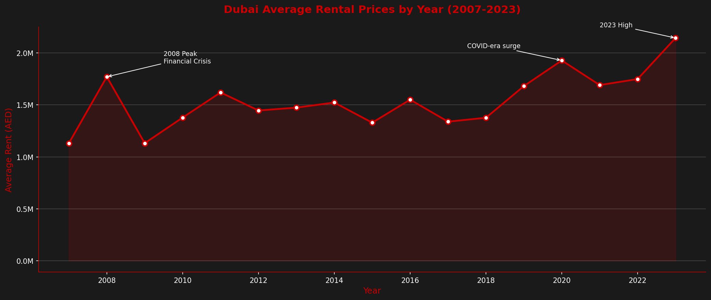
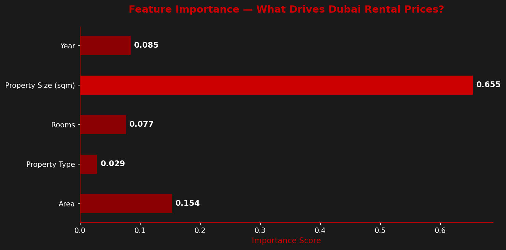

# Dubai Rental Market Trends and Price Prediction

## Overview
Analysis of 16 years of rental transaction data from the Dubai Land Department to uncover market trends and build a machine learning model that predicts rental prices based on property characteristics.

## Key Findings
- Dubai rental prices hit an all time high in 2023 at an average of AED 2.14M, surpassing the 2008 pre-crisis peak
- Prices dropped sharply after the 2008 financial crisis but have been climbing steadily since 2019
- Property size is the strongest predictor of rental price with an importance score of 0.655, outweighing both location and room count
- Area accounts for 15.4% of rental price variation, meaning neighbourhood choice still matters but size dominates

## Model Performance
- Algorithm: Random Forest Regressor
- Mean Absolute Error: AED 318,476
- R² Score: 0.699 (explains 70% of rental price variance)

## Tools Used
- Python
- Pandas
- Matplotlib
- scikit-learn
- Jupyter Notebook

## Data Source
Dubai Land Department - Official Property Transaction Records

## Visualizations

## Purpose of this project

1) How have rental prices changed over the last 16 years and what events drove those changes?
2) Given a property's size, location, type and number of rooms, what rental price should it command?
